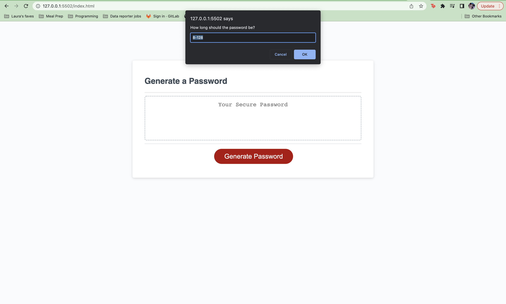
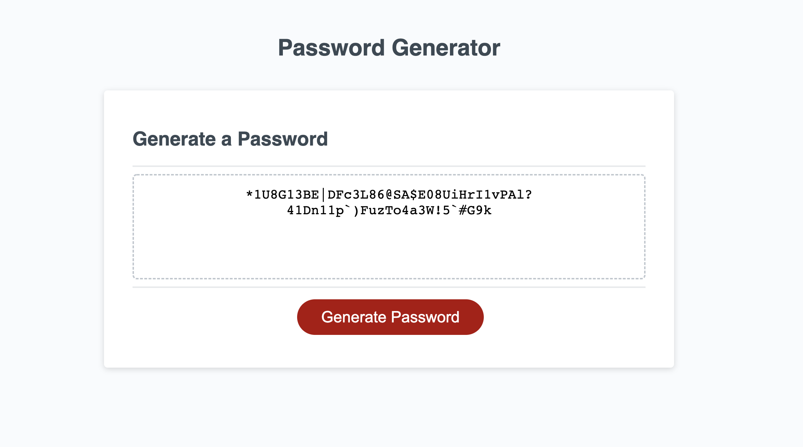

# Password generator

## Project Goals

The goal of this assignment was to make a password generator that takes in user inputs and uses them to randomize characters together. 

## How it works

Upon clicking the generate password button, the user is prompted for the length of the password. 

The prompt then accepts only yes or no to the prompts asking if they want to include uppercase, lowercase, numeric or special characters. 

Behind the scenes, javascript converts the responses into boolean values. It takes the inputted desired length into a variable called pwdLength. The generator then works by pushing functions to an array. These function take single random characters from each of the criteria, uppercase, lowercase, numeric and special characters and adds them as many times as the pwdLength designates. By the end of the loop, the password has been created.

 

### Link to deployed application:

https://lauraantunez024.github.io/PasswordGenerator/

### Credits 

Project was created as part of an assignment for Georgia Tech Coding Bootcamp
